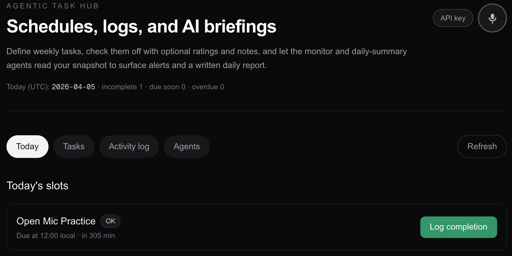
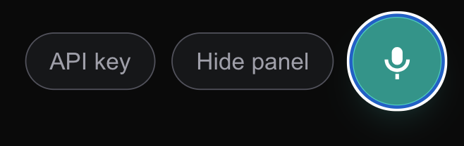

# Task Hub

**Agentic Task Hub** is a [Next.js](https://nextjs.org) app for weekly recurring tasks, completion logs, and optional AI features: a **monitor** agent (alerts from your snapshot), a **daily summary** agent (Markdown brief), and a **voice assistant** that understands what’s on screen and can add tasks from natural language.

Dark UI, SQLite + [Prisma](https://www.prisma.io/) locally, and support for **bring-your-own-key (BYOK)** OpenAI so you can deploy publicly without putting your API key in server env.

---

## Screenshots

### Today & dashboard

The **Today** tab lists today’s scheduled slots from your weekly rules, with status (e.g. due soon, overdue), due times in your configured timezone, and **Log completion** for check-ins.

The header includes **API key** (BYOK) and the **voice** mic, aligned to the main content column.



### Voice assistant

Voice is **toggle-based**: turn the mic on, speak (optionally about the current tab or your tasks), then turn it off to send the transcript to the model. The panel shows conversation history and on-screen hints when the mic is idle.


When the mic is **on**, the control highlights (teal) so you know listening is active. You can **Hide panel** without turning the mic off, or use **API key** to save your OpenAI key in the browser only.



---

## Features

| Area | What it does |
|------|----------------|
| **Tasks** | Create tasks with title, description, priority, and weekly schedules (weekday + optional `HH:MM` in your timezone). |
| **Today** | Derived “slots” for the current day; log completions with optional rating and notes. |
| **Activity log** | History of completions across tasks. |
| **Agents** | **Monitor** — JSON alerts/insights from a live snapshot; **Daily summary** — Markdown report from yesterday’s logs + today’s snapshot. |
| **Voice** | Page-aware chat + optional task creation; requires an OpenAI key (server env or BYOK). |
| **BYOK** | Paste your key in **API key**; stored in `localStorage` only, sent over HTTPS on AI requests. Falls back to `OPENAI_API_KEY` on the server if unset. |

---

## Requirements

- **Node.js** **20.x** (LTS; see `engines` in `package.json` and `.nvmrc`)
- **npm** (or pnpm/yarn/bun)
- **OpenAI** API access for AI features (or rely on server-side `OPENAI_API_KEY` in development)

---

## Getting started

### 1. Install

```bash
npm install
```

### 2. Environment

Copy the example env and adjust:

```bash
cp .env.example .env
```

Important variables:

| Variable | Purpose |
|----------|---------|
| `DATABASE_URL` | **PostgreSQL** connection string (local Docker/Postgres, [Neon](https://neon.tech), etc.) — see `.env.example` |
| `OPENAI_API_KEY` | Optional on the server if every user brings their own key (BYOK) |
| `TASKHUB_TIMEZONE` | IANA timezone for schedules (e.g. `America/New_York`) |
| `OPENAI_CHAT_MODEL` | Optional override (default `gpt-4o-mini`) |

### 3. Database

Create a Postgres database, set `DATABASE_URL` in `.env`, then:

```bash
npx prisma migrate dev
```

This applies migrations in `prisma/migrations`. The app **does not** use SQLite anymore (serverless hosts like Vercel need Postgres or another hosted SQL).

### 4. Dev server

```bash
npm run dev
```

Open [http://localhost:3000](http://localhost:3000).

### 5. Production build

```bash
npm run build
npm start
```

---

## Scripts

| Command | Description |
|---------|-------------|
| `npm run dev` | Next.js dev server |
| `npm run build` | `prisma migrate deploy` + `next build` (needs `DATABASE_URL`) |
| `npm run start` | Production server |
| `npm run lint` | ESLint |

---

## Project layout (high level)

- `src/app/` — App Router pages and `api/` routes (tasks, snapshot, agents, voice).
- `src/components/` — `Dashboard`, voice + BYOK UI.
- `src/lib/` — Prisma client, scheduling/snapshot helpers, OpenAI agents.
- `prisma/` — Schema and migrations (PostgreSQL).

---

## Deploying publicly

- **Vercel / serverless:** Use a hosted Postgres (e.g. [Neon](https://neon.tech)). Set `DATABASE_URL` in the project’s environment variables. See [`VERCEL.md`](VERCEL.md).
- For **no shared OpenAI bill**, omit `OPENAI_API_KEY` and document that users must use **API key** in the app (BYOK).
- Use **HTTPS** in production; voice uses the browser **Web Speech API** (e.g. Chromium, Safari).

---

## Learn more

- [Next.js documentation](https://nextjs.org/docs)
- [Prisma documentation](https://www.prisma.io/docs)

---

## Legal (disclaimers, terms, privacy)

This project includes **generic legal-style documents** to document limitations of liability and AI-related risks. **They are not legal advice** and may not be sufficient for your situation or jurisdiction.

| Document | Purpose |
|----------|---------|
| [`DISCLAIMER.md`](DISCLAIMER.md) | “As is” software, **no warranty**, **limitation of liability**, AI output risks, third-party services |
| [`TERMS_OF_USE.md`](TERMS_OF_USE.md) | End-user style **acceptable use**, AI/BYOK responsibilities, **indemnification** (template — fill in governing law) |
| [`PRIVACY.md`](PRIVACY.md) | High-level **privacy** notes for self-hosting, BYOK, and third parties (template for your own policy) |

**You** (maintainer or host) should have a **qualified attorney** review these before relying on them for a public product, company, or regulated environment.

---

## License

Private / your choice — add a `LICENSE` file if you open-source the repo.
